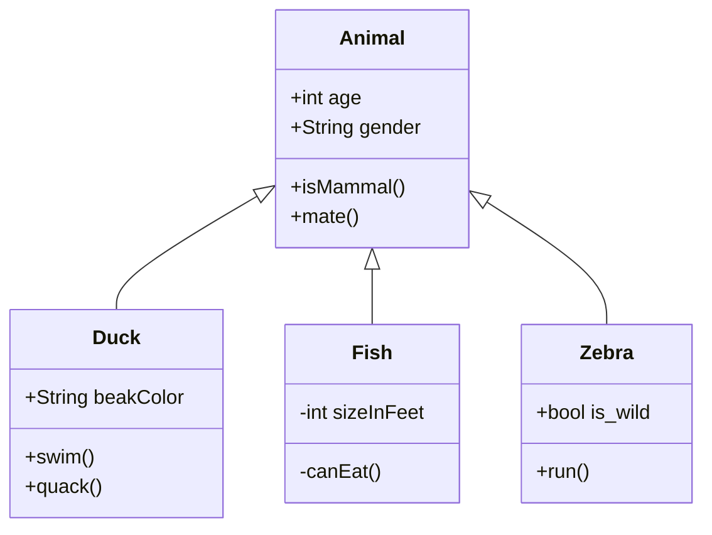

はじめての記事です。

<!-- more -->

# 最初の記事

```go
package main
import "fmt"
func main() {
    fmt.Printf("Hello world !!\n")
}
```

# mermaid.js

<script src="https://cdnjs.cloudflare.com/ajax/libs/mermaid/8.4.4/mermaid.min.js"></script>
<script>
    window.onload = function() {
        mermaid.init(undefined, ".language-mermaid");
    };
</script>



